# SmartAid — UML Architecture Diagrams

This document contains the full set of UML and architecture diagrams for the SmartAid project.

---

## 1. System Architecture Overview

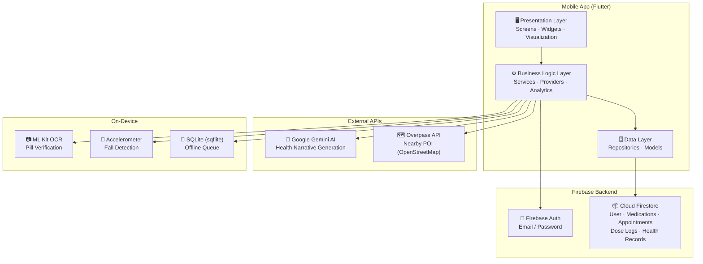

---

## 2. Class Diagram — Data Models

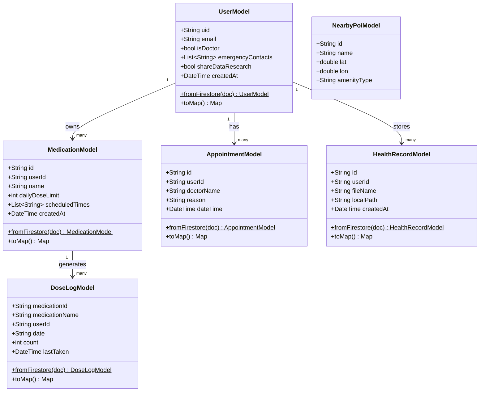

---

## 3. Class Diagram — Repository Layer

```mermaid
classDiagram
    class UserRepository {
        -FirebaseFirestore _db
        +getUserStream(uid) Stream~UserModel~
        +updateEmergencyContacts(uid, contacts) Future
        +updateConsent(uid, consent) Future
    }

    class MedicationRepository {
        -FirebaseFirestore _db
        +getMedicationsStream(uid) Stream~List~MedicationModel~~
        +addMedication(uid, med) Future
        +deleteMedication(uid, medId) Future
        +logDose(uid, medId, name, limit) Future
        +getDoseLogStream(uid, medId, date) Stream~DoseLogModel~
        +getAllDoseLogsStream(uid) Stream~List~DoseLogModel~~
        +getAdherenceHistory(uid, days) Future~Map~
    }

    class AppointmentRepository {
        -FirebaseFirestore _db
        +getAppointmentsStream(uid) Stream~List~AppointmentModel~~
        +addAppointment(uid, appt) Future
        +updateAppointment(uid, appt) Future
        +deleteAppointment(uid, apptId) Future
    }

    class HealthRecordRepository {
        -FirebaseFirestore _db
        +getHealthRecordsStream(uid) Stream~List~HealthRecordModel~~
        +saveRecordMetadata(uid, fileName, localPath) Future
        +deleteRecord(uid, record) Future
        +openLocalFile(path) Future~bool~
    }

    class DoctorDashboardRepository {
        -FirebaseFirestore _db
        +getCumulativeStatsStream() Stream~DoctorDashboardStats~
        +getConsentingPatientsStream() Stream~List~
    }

    class PlacesRepository {
        -http.Client _client
        +fetchNearbyPlaces(lat, lon, amenity) Future~List~PlaceModel~~
    }

    UserRepository --> UserModel
    MedicationRepository --> MedicationModel
    MedicationRepository --> DoseLogModel
    AppointmentRepository --> AppointmentModel
    HealthRecordRepository --> HealthRecordModel
    DoctorDashboardRepository --> DoctorDashboardStats
    PlacesRepository --> PlaceModel
```

---

## 4. Class Diagram — Service Layer

```mermaid
classDiagram
    class MedicationService {
        -MedicationRepository medicationRepository
        +getMedicationsStream(uid) Stream
        +addMedication(uid, data) Future
        +logIntake(userId, medicationId, name, limit) Future
        +getDoseLogStream(uid, medId, date) Stream
        +getAllDoseLogsStream(uid) Stream
        +todayKey() String
    }

    class AppointmentService {
        -AppointmentRepository appointmentRepository
        +getAppointmentsStream(uid) Stream
        +addAppointment(uid, data) Future
        +updateAppointment(uid, appt) Future
        +deleteAppointment(uid, id) Future
    }

    class HealthRecordService {
        -HealthRecordRepository healthRecordRepository
        +getHealthRecordsStream(uid) Stream
        +saveRecordMetadata(uid, fileName, localPath) Future
        +deleteRecord(uid, record) Future
        +openLocalFile(path) Future~bool~
    }

    class UserService {
        -UserRepository userRepository
        +getUserStream(uid) Stream~UserModel~
        +addEmergencyContact(uid, contact) Future
        +removeEmergencyContact(uid, contact) Future
        +updateConsent(uid, consent) Future
    }

    class FallDetectionService {
        -StreamSubscription _subscription
        -Timer _countdownTimer
        -bool _sosActive
        +List~String~ emergencyContacts
        +String emergencyNumber
        +Function onCountdown
        +Function onSosSent
        +startListening() void
        +stopListening() void
        +cancelSos() void
        -_triggerFallProtocol() void
        -_sendSos() Future
    }

    class PillVerificationService {
        -TextRecognizer _textRecognizer
        -ImagePicker _picker
        +scanAndVerify(expectedMedName) Future~PillScanResult~
        -_fuzzyContains(haystack, needle) bool
        +dispose() void
    }

    class PdfExportService {
        +generateAndSharePdf(report) Future
        -_buildPdfContent(report) pw.Document
    }

    class OfflineSyncService {
        -MedicationRepository medicationRepository
        -AppointmentRepository appointmentRepository
        -LocalDbService _localDb
        +bool isSyncing
        +int pendingCount
        +syncPending() Future
        -_listenToConnectivity() void
    }

    class LocalDbService {
        -Database _db
        +queueOperation(table, data) Future
        +getPendingOperations() Future~List~
        +markSynced(id) Future
        +initDb() Future
    }

    MedicationService --> MedicationRepository
    AppointmentService --> AppointmentRepository
    HealthRecordService --> HealthRecordRepository
    UserService --> UserRepository
    OfflineSyncService --> LocalDbService
    OfflineSyncService --> MedicationRepository
    OfflineSyncService --> AppointmentRepository
```

---

## 5. Class Diagram — Analytics & AI

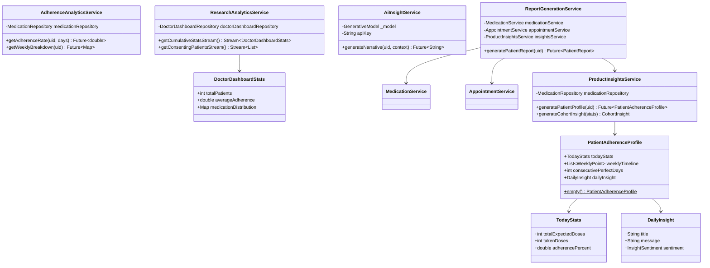

---

## 6. Sequence Diagram — User Login & Navigation

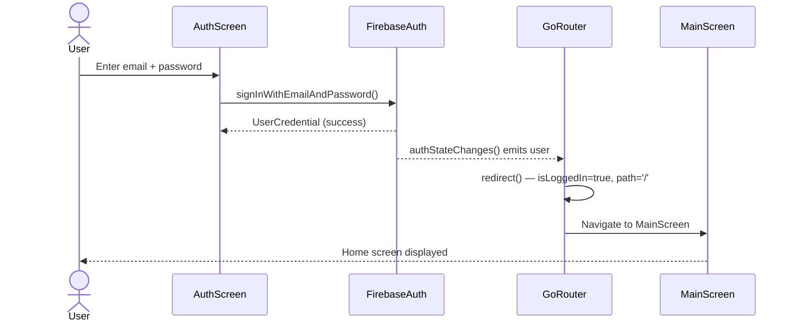

---

## 7. Sequence Diagram — Log a Medication Dose

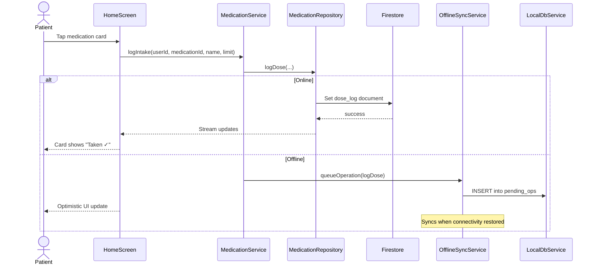

---

## 8. Sequence Diagram — Fall Detection & SOS

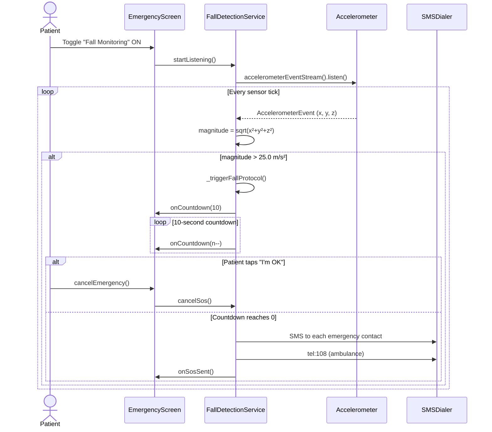

---

## 9. Sequence Diagram — Pill Verification (OCR)

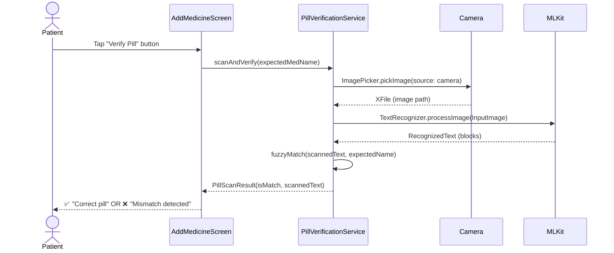

---

## 10. Component Diagram — Full System

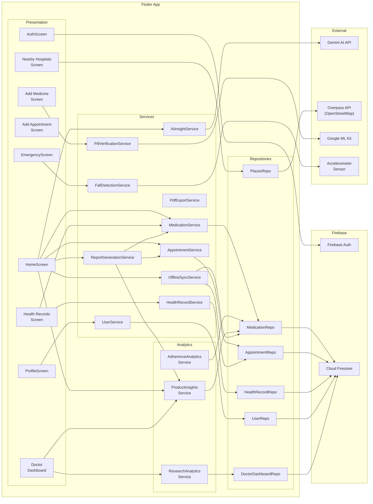

---

## 11. State Diagram — Medication Dose Flow

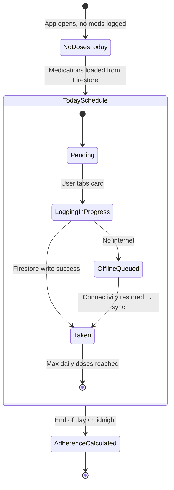

---

## 12. Deployment Diagram

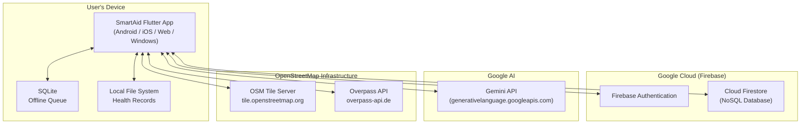

---

> **Note:** These diagrams are rendered using [Mermaid](https://mermaid.js.org/). GitHub renders Mermaid diagrams natively in Markdown files.
